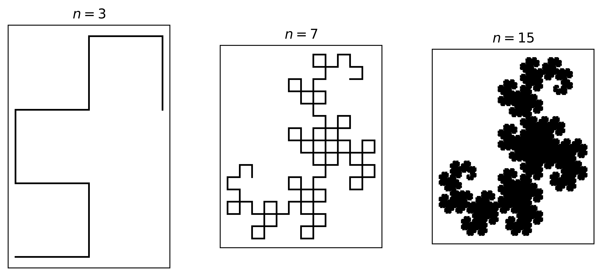
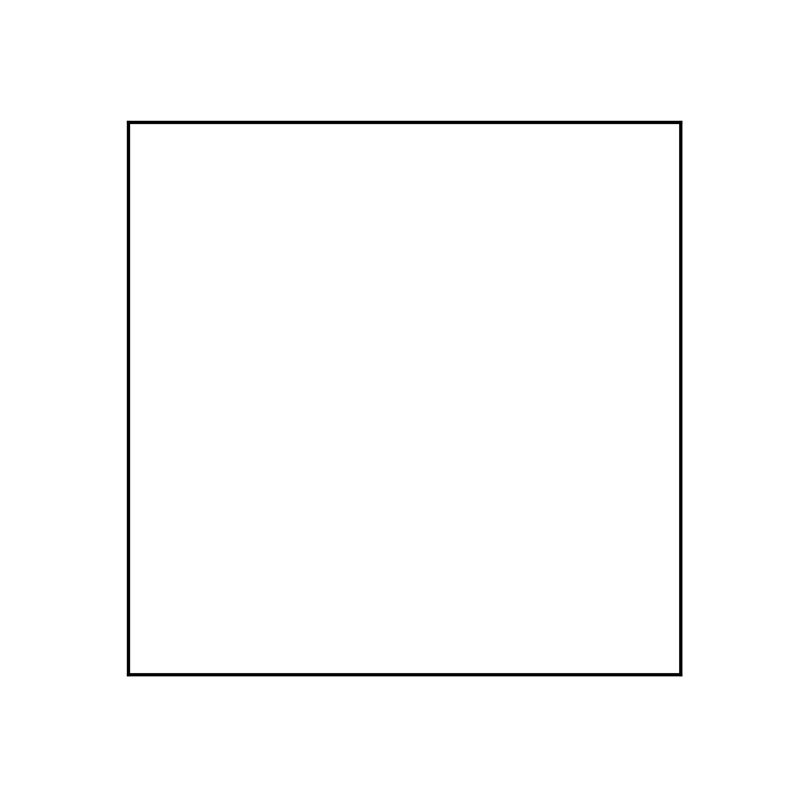
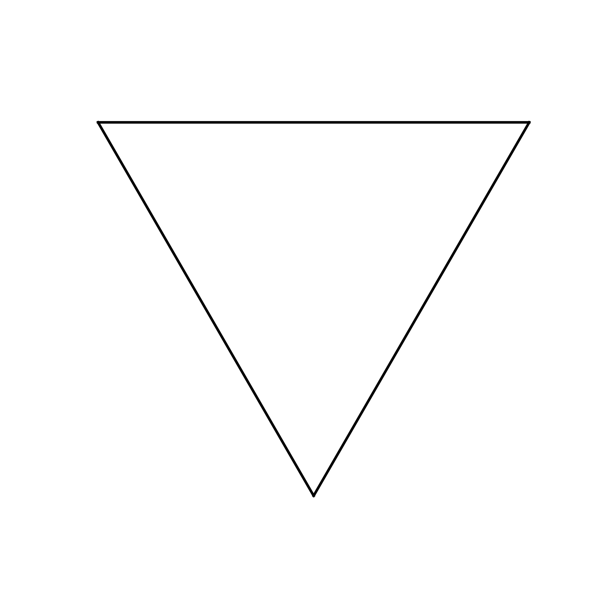
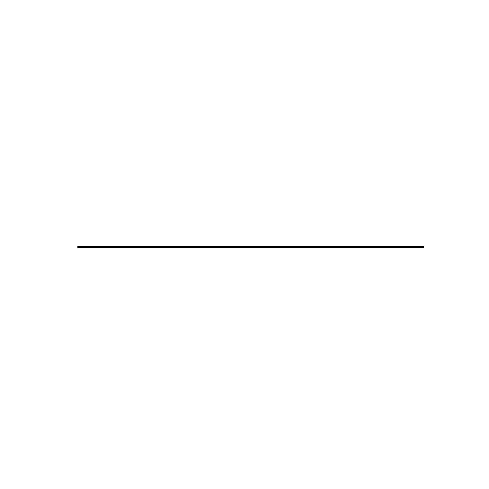

# Drawing Fractals with L-System

[L-System](https://en.wikipedia.org/wiki/L-system) is a system consisting of an alphabet following a set of grammars and an axiom. The system can demonstrates growth through a process of substituting certain symbol in the alphabet with a sequence of symbols from the same alphabet.

### Table of Contents
- [Example](#example)
- [Quickstart](#quickstart)
- [L_sys](#l_sys)
- [Gallery](#gallery)

## Example
For example, we can consider the L-system that draws a [Dragon Curve](https://en.wikipedia.org/wiki/Dragon_curve):
- **Alphabet**: `['F', 'G', '+', '-']`

    where each symbol can be interpreted in terms of turtle graphics as
    - `'F'`, `'G'`: draw forward
    - `+`: turn left by 90&deg;
    - `-`: turn right by 90&deg;
- **Grammars**:
    - `'F'` &#8594; `'F+G'`
    - `'G'` &#8594; `'G-F'`
- **Axiom**: `'F'`

Starting from the axiom, we get some of the following sequnces:
- $n=1$: `'F+G'`
- $n=3$: `'F+G+F-G+F+G-F-G'`
- $n=7$:
    ```
    F+G+F-G+F+G-F-G+F+G+F-G-F+G-F-G+F+G+F-G+F+G-F-G-F+G
    +F-G-F+G-F-G+F+G+F-G+F+G-F-G+F+G+F-G-F+G-F-G-F+G+F-
    G+F+G-F-G-F+G+F-G-F+G-F-G+F+G+F-G+F+G-F-G+F+G+F-G-F
    +G-F-G+F+G+F-G+F+G-F-G-F+G+F-G-F+G-F-G-F+G+F-G+F+G-
    F-G+F+G+F-G-F+G-F-G-F+G+F-G+F+G-F-G-F+G+F-G-F+G-F-G
    ```
- $n=15$: yeah no, it's going to be a bit long

Using turtle graphics to draw each symbol, we can get the following graphs:


## Quickstart
You can grow your own L-System using the built-ins:
```py
import matplotlib.pyplot as plt
from L_sys.builtin import DragonCurve

dragon_curve = DragonCurve()
# grow from the axiom
state = dragon_curve(num_iters=7)

# to draw the graphic, just get the line segments
# coordinate and plot with matplotlib
xs, ys = dragon_curve.process_state(state)
plt.plot(xs, ys, c='black')
plt.show()
```
This will draw you the Dragon Curve at the seventh iteration.

You can also mess around by altering grammars, alphbets, different turning angles and so on. Visit [demo.ipynb](demo.ipynb) for more information.

## `L_sys`
The L_sys package builds a base L-system `LSystem`. This system has the following default rules:
- Alphabet:
    - `F`, `G`: draw forward
    - `+`: turn left by the turning angle (in degrees).
    - `-`: turn right by the turning angle (in degrees).
    - `*`: multiply the current line segment length by the shrink factor.
    - `/`: divide the current line segment length by the shrink factor (this is equivalent to enlarging the line segment).
    - `[`: push the current position and direction (in degrees) to the stack.
    - `]`: pop the previous position and direction (in degrees) from the stack.
    - any other unrecognised symbols will be ignored.
- Turning angle: 90&deg;
- Shrink factor: 1

With this, you can build your own L-System by inheriting from the base class and then specify some rules as well as changing some other configurations.
```py
import matplotlib.pyplot as plt
from L_sys.base import LSystem

class Sierpinski(LSystem):
    def __init__(self):
        rules = {
            'F': 'F-G+F+G-F',
            'G': 'GG'
        }
        turning_angle=120
        initial_state='F-G-G'
        super().__init__(rules, initial_state, turning_angle)

    def process_state(self,
        state: str,
        start_pos: tuple[int | float, int | float] = (0, 0),
        heading: int | float = 0,
        length: int | float = 1
    ):
        return super().process_state(state, start_pos, heading, length)

sierpinski = Sierpinski()
plt.plot(*sierpinski.process_state(sierpinski.grow(num_iters=8)), c='black')
plt.show() 
```

## Gallery
<details>
    <summary>
        &#128009;<b>Dragon curve</b>
    </summary>
    <br>
    
</details>

<details>
    <summary>
        &#127807;<b>Fractal Tree and Fractal Plant</b>
    </summary>
    <br>
    
    
</details>

<details>
    <summary>
        &#10054;<b> Levy's and Koch's Curve</b>
    </summary>
    <br>
    
    
</details>

<details>
    <summary>
        &#9650;<b> Sierpinski's Triangle</b>
    </summary>
    <br>
    
</details>