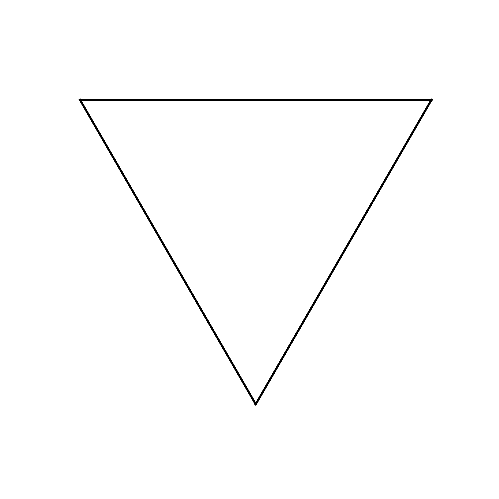

# Graphics Drawing with Python (of course)
This repo is meant for graphical projects that are too small to belong to a single repo.

### Table of Contents
- [Lindenmayer's System](#lindenmayers-system)
- [Mandelbrot's Set](#mandelbrots-set)

## Lindenmayer's System
<table cellspacing="0">
    <tbody>
        <tr>
            <td></td>
            <td></td>
            <td rowspan=2>
                
            </td>
        </tr>
        <tr>
            <td></td>
            <td></td>
        </tr>
    </tbody>
</table>

Visit [README.md](./Lindenmayer/README.md) for more information.

## Mandelbrot's Set
<table cellspaceing="0">
    <tbody>
        <tr>
            <td></td>
            <td></td>
        </tr>
        <tr>
            <td></td>
            <td></td>
        </tr>
    </tbody>
</table>